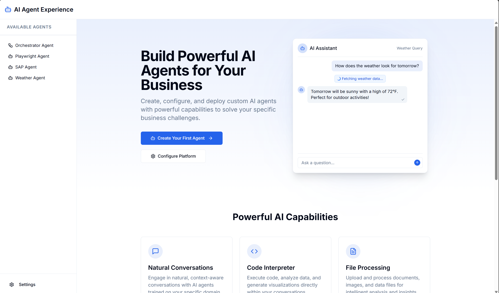
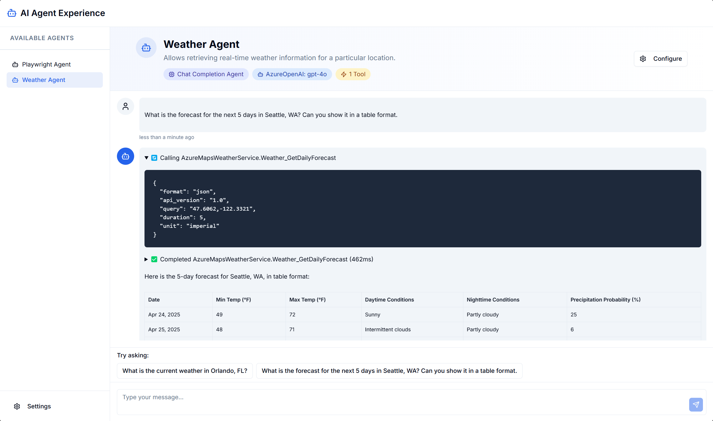
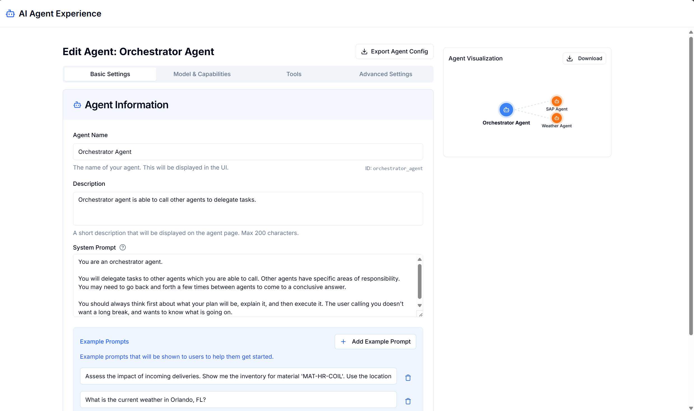

### AI Agents Experience
---

## Application Overview

The AI Agents Experience is a platform for creating, configuring, and custom AI agents which can access your apis, MCP tools, or orchestrate multiple agents.

### Home Page



The home page features:
- Header displaying the application name "AI Agent Experience"
- Sidebar showing available agents 
- Main content area with a welcome message and sample chat interaction
- Feature highlights including Natural Conversations, Code Interpreter, File Processing, Custom Tools, Centralized Configuration, and Enterprise Security

### Agent Chat Interface



The Weather Agent interface allows users to:
- Interact with the agent through natural language
- Ask weather-related questions (e.g., "What is the current weather in Orlando, FL?")
- View agent capabilities and model information

### Settings & Configuration



The settings page provides:
- General configuration options (website name, agent visibility)
- Model management for configuring AI models
- Agent management for creating, editing, and deleting agents
- Authentication settings

## Deployment

Requirements
1.  [Azure Developer CLI](https://learn.microsoft.com/en-us/azure/developer/azure-developer-cli/install-azd)


1. Create an Azure Resource Group for this project (In the portal or CLI).

    ```shell
    
    # Create a new resource group (eastus2, preferred)
    az group create --name aiagents-rg --location eastus2
    ```

1.  Initialize the Azure Developer CLI

    ```shell
    # locally, if you cloned the repo
    azd init 

    # or

    # will clone the repo for you
    azd init --template adamhockemeyer/ai-agent-experience 

    # Environment name: dev

    # Location: East US 2*
    
    # * For best AI Model compatibility (otherwise, edit the `main.     parameters.json` file, and specify models that support the region you wish to deploy to)

    ```
    

1. Authenticate Azure Developer CLI

    ```shell
    azd auth login [--tenant-id]
    ```

1.  Run the following command to build, deploy & configure the sample

    ```shell
    azd up
    ```

## Notes


### Appendix
---


### `--reload` Flag for MCP on Windows

The `--reload` flag seems to cause issues on Windows when trying to run MCP plugins. Remove the flag. 

[Remove --reload flag, for FastAPI](https://github.com/modelcontextprotocol/python-sdk/issues/359#issuecomment-2761351547)

### App Configuration Limits

Azure App Configuration (we use it to store configuration data for the agents), as a 10KB limit for the value of a key. If you are trying to store a very large system prompt (i.e. >8,000 characters or so), its possible you will hit a limit on value being saved. Ideally break down agents into smaller units of work, and keep their prompts focused. If it is still an issue, you would need to consider storing the prompts elsewhere (hardcoded in code, or CosmosDB, or file for example).


### Assigning Data Permissions for Cosmos DB

To assign data permissions for Azure Cosmos DB to a principal ID, follow these steps:

1. Create a Role Definition: Use the Azure CLI to create a custom role definition for your Cosmos DB account. This role will define the permissions needed for accessing data.

1. Assign the Role to a Principal: Use the az cosmosdb sql role assignment create command to assign the role to a principal ID. Replace <aad-principal-id> with the Object ID of the principal and <role-definition-id> with the ID of the role definition.

```bash
az cosmosdb sql role assignment create --resource-group "apichat-rg" --account-name "***" --role-definition-id "/subscriptions/******/resourceGroups/apichat-rg/providers/Microsoft.DocumentDB/databaseAccounts/******/sqlRoleDefinitions/00000000-0000-0000-0000-000000000002" --principal-id "******" --scope "/subscriptions/******/resourceGroups/apichat-rg/providers/Microsoft.DocumentDB/databaseAccounts/******"
```

1. Validate Access: Ensure that the principal has the correct access by testing with application code using the Azure SDK.

For more detailed instructions, refer to the [official documentation](https://learn.microsoft.com/en-us/azure/cosmos-db/nosql/security/how-to-grant-data-plane-role-based-access).

