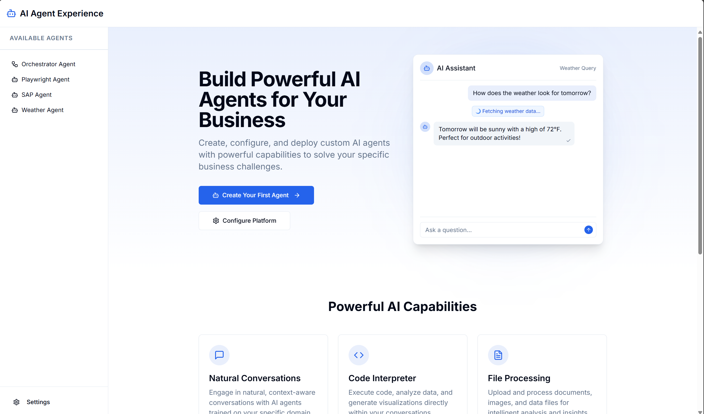
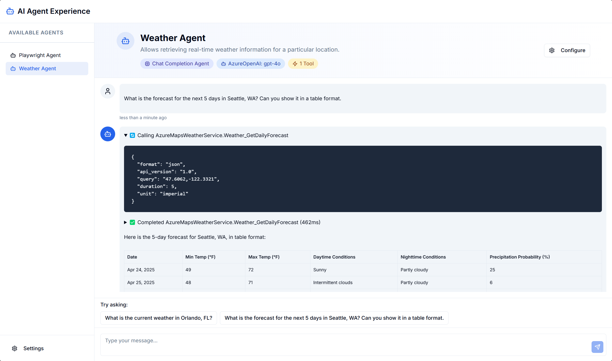
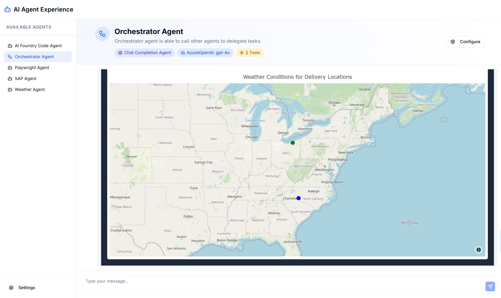
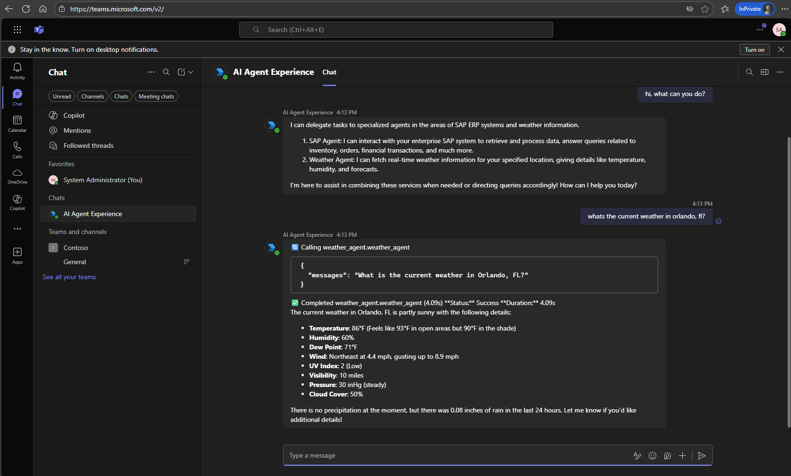
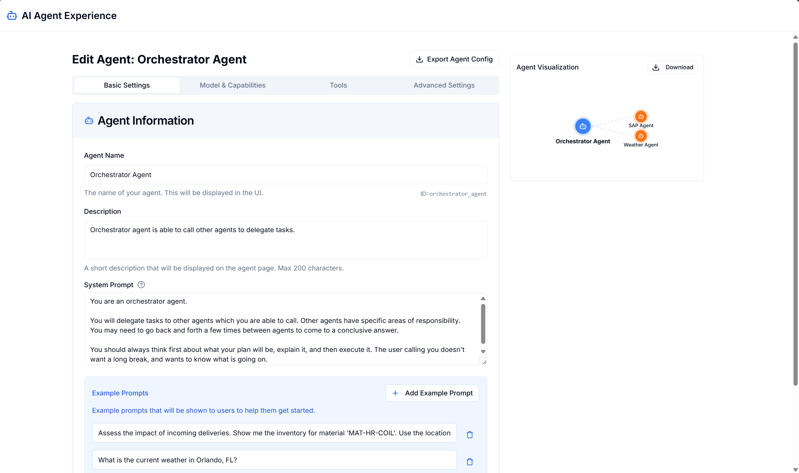
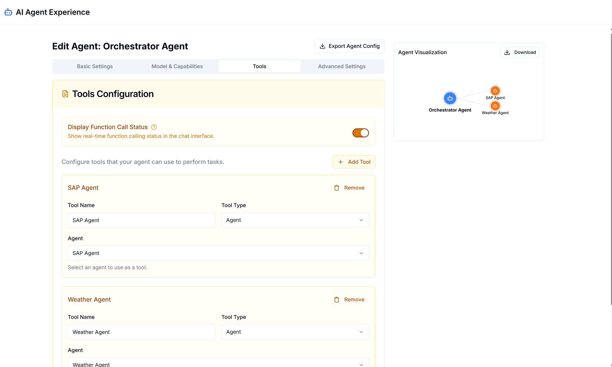
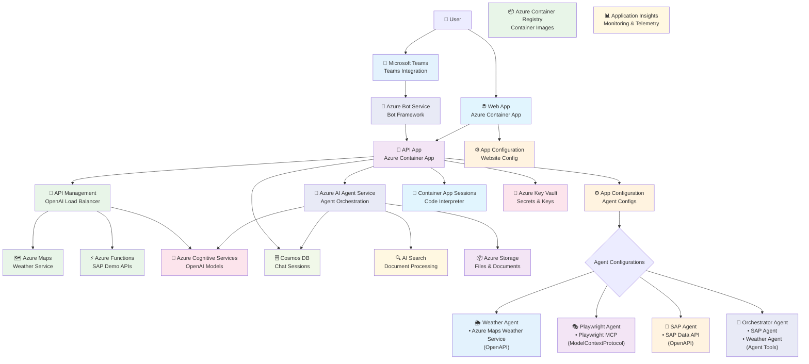

### AI Agents Experience
---

## Application Overview

The AI Agents Experience is a platform for creating, configuring, and extending custom AI agents which can access your apis, MCP tools, or orchestrate multiple agents. The solution utilizes [Semantic Kernel](https://github.com/microsoft/semantic-kernel) to dynamically build agents and plugins based on the configuration the user desires.


### Home Page



The home page features:
- Sidebar showing available agents 
- Main content area with a welcome message and sample chat interaction
- Feature highlights including Natural Conversations, Code Interpreter, File Processing, Custom Tools, Centralized Configuration, and Enterprise Security

### Agent Chat Interface



The Weather Agent interface allows users to:
- Interact with the agent through natural language
- Ask weather-related questions (e.g., "What is the current weather in Orlando, FL?")
- View agent capabilities and model information

### Visualize Data Using Rich HTML, Javascript, and CSS



### Microsoft Teams Integration



The platform integrates with Microsoft Teams through the [Microsoft Agents SDK](https://github.com/microsoft/agents), which connects to the backend API and exposes Semantic Kernel agents to Teams using Azure Bot Service. This allows users to interact with AI agents directly within their Teams environment.

### Settings & Configuration



The settings page provides:
- General configuration options (website name, agent visibility)
- Model management for configuring AI models
- Agent management for creating, editing, and deleting agents
- Authentication settings

### Orchestrate Multiple Agents



## Deployment

Requirements
1.  [Azure Developer CLI](https://learn.microsoft.com/en-us/azure/developer/azure-developer-cli/install-azd)


1. Create an Azure Resource Group for this project (In the portal or CLI).

    ```shell
    
    # Create a new resource group (eastus2, preferred)
    az group create --name aiagents-rg --location eastus2
    ```

1.  Initialize the Azure Developer CLI

    ```shell
    # locally, if you cloned the repo
    azd init 

    # or

    # will clone the repo for you
    azd init --template adamhockemeyer/ai-agent-experience 

    # Environment name: dev

    # Location: East US 2*
    
    # * For best AI Model compatibility (otherwise, edit the `main.parameters.json` file, and specify models that support the region you wish to deploy to)

    ```
    

1. Authenticate Azure Developer CLI

    ```shell
    azd auth login [--tenant-id]
    ```

1.  Run the following command to build, deploy & configure the sample

    ```shell
    azd up
    ```

## MCP Tool Configuration Examples

The AI Agents platform supports Model Context Protocol (MCP) tools for extending agent capabilities. Here are some common MCP tool configuration examples:

### Document Search MCP Server (SSE)
```json
{
  "mcpServers": {
    "documentSearch": {
      "type": "sse", 
      "url": "https://your-function-app.azurewebsites.net/runtime/webhooks/mcp/sse",
      "auth": {
        "headers": {
          "x-functions-key": "your-function-key-here-mcp_extension"
        }
      }
    }
  }
}
```

### Playwright Browser Automation MCP Server
```json
{
  "mcpServers": {
    "playwright": {
      "command": "npx",
      "args": [
        "@playwright/mcp@latest",
        "--headless",
        "--no-sandbox"
      ]
    }
  }
}
```


> **Note**: Replace placeholder values like `your-function-app.azurewebsites.net` and `your-function-key-here` with your actual deployment values. Function keys can be found in the Azure Portal under your Function App's "App keys" section, and use the `mcp_extension` key.

## Notes


### Appendix
---


### `--reload` Flag for MCP on Windows

The `--reload` flag seems to cause issues on Windows when trying to run MCP plugins. Remove the flag. 

[Remove --reload flag, for FastAPI](https://github.com/modelcontextprotocol/python-sdk/issues/359#issuecomment-2761351547)


### App Configuration Limits

Azure App Configuration (we use it to store configuration data for the agents), as a 10KB limit for the value of a key. If you are trying to store a very large system prompt (i.e. >8,000 characters or so), its possible you will hit a limit on value being saved. Ideally break down agents into smaller units of work, and keep their prompts focused. If it is still an issue, you would need to consider storing the prompts elsewhere (hardcoded in code, or CosmosDB, or file for example).


### Assigning Data Permissions for Cosmos DB

To assign data permissions for Azure Cosmos DB to a principal ID, follow these steps:

1. Create a Role Definition: Use the Azure CLI to create a custom role definition for your Cosmos DB account. This role will define the permissions needed for accessing data.

1. Assign the Role to a Principal: Use the az cosmosdb sql role assignment create command to assign the role to a principal ID. Replace <aad-principal-id> with the Object ID of the principal and <role-definition-id> with the ID of the role definition.

```bash
az cosmosdb sql role assignment create --resource-group "apichat-rg" --account-name "***" --role-definition-id "/subscriptions/******/resourceGroups/apichat-rg/providers/Microsoft.DocumentDB/databaseAccounts/******/sqlRoleDefinitions/00000000-0000-0000-0000-000000000002" --principal-id "******" --scope "/subscriptions/******/resourceGroups/apichat-rg/providers/Microsoft.DocumentDB/databaseAccounts/******"
```

1. Validate Access: Ensure that the principal has the correct access by testing with application code using the Azure SDK.

For more detailed instructions, refer to the [official documentation](https://learn.microsoft.com/en-us/azure/cosmos-db/nosql/security/how-to-grant-data-plane-role-based-access).

## Teams Setup


- Azure Bot Service Resource in Azure is required
  - The `Messaging endpoint` is the api backend + `/api/messages` (i.e. `https://api.something.eastus2.azurecontainerapps.io/api/messages`)
  - Ensure the Teams channel is configured.
  - You will need to manually create an app secret for the app registration for now.
- Create a new teams app, fill in the required information and download the app manifest
  - https://dev.teams.microsoft.com/
- Upload the app manifest into the teams admin portal
  - https://admin.teams.microsoft.com/policies/manage-apps
- Example
  - https://github.com/Azure-Samples/AI-Foundry-Connections/tree/main/src/samples/adb_aifoundry_teams


## Architecture Overview


```mermaid
graph TB
    User[👤 User] --> WebApp[🌐 Web App<br/>Azure Container App]
    User --> Teams[💬 Microsoft Teams<br/>Teams Integration]
    
    Teams --> BotService[🤖 Azure Bot Service<br/>Bot Framework]
    BotService --> APIApp[🔌 API App<br/>Azure Container App]
    
    WebApp --> AppConfig1[⚙️ App Configuration<br/>Website Config]
    WebApp --> APIApp
    
    APIApp --> AppConfig2[⚙️ App Configuration<br/>Agent Configs]
    APIApp --> AIAgentService[🤖 Azure AI Agent Service<br/>Agent Orchestration]
    APIApp --> APIM[🔗 API Management<br/>OpenAI Load Balancer]
    
    APIM --> Maps[🗺️ Azure Maps<br/>Weather Service]
    APIM --> Functions[⚡ Azure Functions<br/>SAP Demo APIs]
    APIM --> CognitiveServices[🧠 Azure Cognitive Services<br/>OpenAI Models]
    
    %% Position Cosmos DB next to Cognitive Services
    CosmosDB[🗄️ Cosmos DB<br/>Chat Sessions]
    
    %% Connect API App to Cosmos DB after positioning
    APIApp --> CosmosDB
    
    AIAgentService --> Search[🔍 AI Search<br/>Document Processing]
    AIAgentService --> Storage[📦 Azure Storage<br/>Files & Documents]
    AIAgentService --> CognitiveServices
    AIAgentService --> CosmosDB
    
    APIApp --> SessionPools[🐍 Container App Sessions<br/>Code Interpreter]
    APIApp --> KeyVault[🔐 Azure Key Vault<br/>Secrets & Keys]
    
    AppConfig2 --> AgentConfigs{Agent Configurations}
    AgentConfigs --> Weather["🌦️ Weather Agent<br/>• Azure Maps Weather Service<br/>(OpenAPI)"]
    AgentConfigs --> Playwright["🎭 Playwright Agent<br/>• Playwright MCP<br/>(ModelContextProtocol)"]
    AgentConfigs --> SAP["💼 SAP Agent<br/>• SAP Data API<br/>(OpenAPI)"]
    AgentConfigs --> Orchestrator["🎯 Orchestrator Agent<br/>• SAP Agent<br/>• Weather Agent<br/>(Agent Tools)"]
    
    style WebApp fill:#e1f5fe
    style Teams fill:#e3f2fd
    style BotService fill:#e8eaf6
    style APIApp fill:#f3e5f5
    style AppConfig1 fill:#fff3e0
    style AppConfig2 fill:#fff3e0
    style APIM fill:#e8f5e8
    style Maps fill:#e8f5e8
    style Functions fill:#e8f5e8
    style CognitiveServices fill:#fce4ec
    style AIAgentService fill:#e8eaf6
    style CosmosDB fill:#f1f8e9
    style Search fill:#fff8e1
    style Storage fill:#f3e5f5
    style SessionPools fill:#e1f5fe
    style KeyVault fill:#fce4ec
    style Weather fill:#e3f2fd
    style Playwright fill:#f3e5f5
    style SAP fill:#fff3e0
    style Orchestrator fill:#e8eaf6
    
    %% Standalone services positioned at bottom - defined last to appear at bottom
    ContainerRegistry[📦 Azure Container Registry<br/>Container Images]
    AppInsights[📊 Application Insights<br/>Monitoring & Telemetry]
    style ContainerRegistry fill:#e8f5e8
    style AppInsights fill:#fff8e1
```

