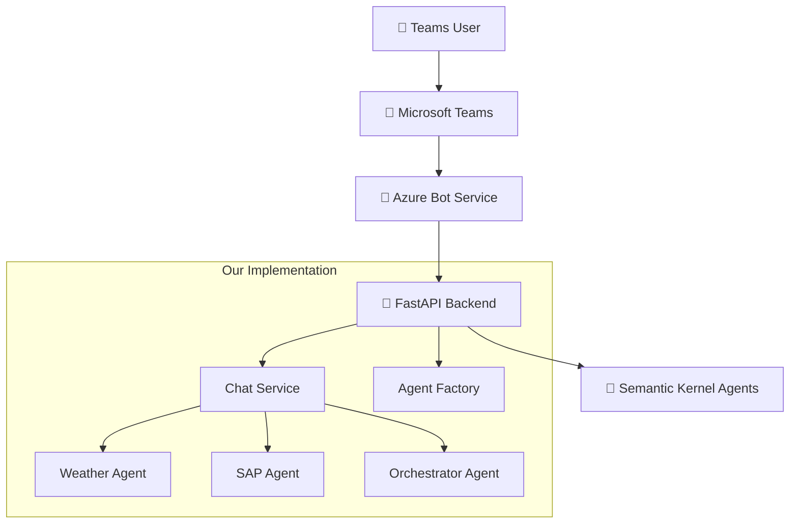

# Teams Bot Setup Guide

## Overview

This guide explains how to expose Semantic Kernel agents through Azure Bot Service and make them accessible via Microsoft Teams. This approach allows users to interact with your AI agents directly within Teams using the Bot Framework protocol.

## Architecture Overview



## Prerequisites

- Azure subscription with appropriate permissions
- Existing Semantic Kernel agent implementation
- FastAPI backend with agent endpoints
- Visual Studio Code with Azure extensions
- Azure Developer CLI (azd)

## Step 1: Create Azure Bot Service

### Option A: Using Azure Portal (Manual)

1. **Create Azure Bot Service**
   - Navigate to [Azure Portal Bot Service](https://portal.azure.com/#create/Microsoft.AzureBot)
   - Provide Bot handle name
   - Select **Single tenant** as Type of App
   - Choose **Global** for Data Residency
   - Select **Free** pricing tier (upgrade for production)
   - Create new Microsoft App ID

2. **Configure Bot Settings**
   - Go to your Bot resource → **Configuration**
   - Note the **Bot ID** (Microsoft App ID) and **Tenant ID**
   - Set **Messaging Endpoint** to: `https://your-api-url.com/api/messages`
   - Enable **Microsoft Teams** channel

### Option B: Using Infrastructure as Code (Recommended)

Our project includes Bicep templates that automatically create:
- Microsoft Entra App Registration
- Azure Bot Service
- Teams channel configuration
- Proper permissions and redirect URIs

```bash
# Deploy with azd (includes Bot Service setup)
azd up
```

## Step 2: Configure App Registration

### Authentication Settings

1. **Navigate to App Registration**
   - Go to [Azure Portal App Registrations](https://portal.azure.com/#view/Microsoft_AAD_RegisteredApps/ApplicationsListBlade)
   - Find your bot's app registration

2. **Configure Authentication**
   - Click **Authentication** → **Add a Platform** → **Web**
   - Add redirect URL: `https://token.botframework.com/.auth/web/redirect`
   - Enable **Access tokens** and **ID tokens** checkboxes

3. **Create Client Secret**
   - Go to **Certificates & secrets**
   - Create new client secret and store securely
   - This will be used in your environment variables

### API Permissions

Add the following permissions:
- **Microsoft Graph (Delegated)**:
  - `openid`
  - `profile`
  - `User.Read`

### Expose an API

1. **Set App ID URI**
   - Go to **Expose an API**
   - Set App ID URI as: `api://botid-{your-bot-app-id}`

2. **Add Scope**
   - Create scope named `access_as_user`
   - Allow both **Admins and users**
   - Enable the scope

3. **Add Client Applications**
   - Add these two client IDs (Teams desktop/mobile and web clients):
     - `1fec8e78-bce4-4aaf-ab1b-5451cc387264`
     - `5e3ce6c0-2b1f-4285-8d4b-75ee78787346`

## Step 3: Implement Bot Framework Integration

### Add Dependencies

```txt
# Microsoft Agents SDK packages
microsoft-agents-hosting-core
microsoft-agents-hosting-aiohttp
microsoft-agents-authentication-msal
microsoft-agents-activity
```

### Create Bot Framework Endpoint

Create `/api/messages` endpoint in your FastAPI application:

```python
# app/routes/agents_sdk.py
from fastapi import APIRouter, Request, Depends
from microsoft_agents import CloudAdapter, Activity

router = APIRouter()

@router.post("/api/messages")
async def handle_messages(request: Request):
    # Initialize CloudAdapter with authentication
    adapter = CloudAdapter(connection_manager)
    
    # Process Bot Framework activity
    activity = await request.json()
    
    # Route to your existing agent logic
    response = await process_agent_request(activity)
    
    return response
```

### Bridge Services

Create bridge services to connect Bot Framework with your Semantic Kernel agents:

1. **Agent Bridge Service**: Maps Bot Framework conversations to agent configurations
2. **State Bridge Service**: Manages conversation state and session persistence
3. **Stream Bridge Service**: Converts Semantic Kernel streaming to Bot Framework responses
4. **Auth Bridge Service**: Handles MSAL authentication and JWT validation

## Step 4: Environment Configuration

Set up the required environment variables:

```bash
# Bot Framework Configuration
MICROSOFT_AGENTS_CLIENT_ID=your-bot-app-id
MICROSOFT_AGENTS_CLIENT_SECRET=your-client-secret
MICROSOFT_AGENTS_TENANT_ID=your-tenant-id
BOT_APP_ID=your-bot-app-id

# Optional: OAuth Connection Settings
MICROSOFT_AGENTS_BOT_OAUTH_CONNECTION_NAME=your-connection-name
```

## Step 5: Deploy and Test

### Deploy Your Application

```bash
# If using azd
azd up

# Update bot messaging endpoint after deployment
# Go to Azure Portal → Bot Service → Configuration
# Set Messaging Endpoint to: https://your-deployed-api-url.com/api/messages
```

### Test in Azure Portal

1. Go to your Bot Service in Azure Portal
2. Click **Test in Web Chat**
3. Send a message to test the integration
4. Verify responses are coming from your Semantic Kernel agents

## Step 6: Create Teams App Manifest

### Using Teams Developer Portal

1. **Navigate to Teams Developer Portal**
   - Go to [dev.teams.microsoft.com](https://dev.teams.microsoft.com/)
   - Click **New App**

2. **Configure Basic Information**
   - Fill in app name, description, developer info
   - Set **Application Client ID** to your Bot App ID
   - Set **Website URL** to your application URL

3. **Configure Bot Features**
   - In **App Features**, select **Bot**
   - Enter your **Bot ID**
   - Select scopes: **Personal**, **Team**, **GroupChat**

4. **Single Sign-On Configuration**
   - Set **App ID URI**: `api://botid-{your-bot-app-id}`

5. **Download Manifest**
   - Fix any validation errors
   - Download the app package (ZIP file)

## Step 7: Deploy to Teams

### Upload to Teams Admin Center

1. **Access Teams Admin Center**
   - Go to [admin.teams.microsoft.com](https://admin.teams.microsoft.com/)
   - Navigate to **Teams** → **Manage Apps**

2. **Upload Custom App**
   - Click **Actions** → **Upload New App**
   - Select your downloaded app manifest ZIP file
   - Wait for approval/processing

### Test in Teams

1. **Access Teams**
   - Go to [teams.microsoft.com](https://teams.microsoft.com/)
   - Click **Apps** in the left pane
   - Search for your app and click **Add**

2. **Test Agent Interaction**
   - Start a conversation with your bot
   - Test various agent capabilities:
     - Simple questions
     - Agent delegation (orchestrator → specialized agents)
     - Tool/function calling
     - Streaming responses

## Agent Selection and Configuration

### Default Orchestrator Pattern

Our implementation uses a default orchestrator agent that delegates to specialized agents:

```python
# Example agent delegation flow
user_message = "What's the weather in Orlando?"
# → Orchestrator Agent
# → Weather Agent (via Azure Maps)
# → Formatted response back to Teams
```

### Query Parameter Support

You can specify specific agents using the `agentid` parameter:

```
https://your-api-url.com/api/messages?agentid=weather_agent
```

## Troubleshooting

### Common Issues

1. **Authentication Errors**
   - Verify client secret is correct and not expired
   - Check App Registration permissions
   - Ensure service principal exists for the app

2. **Messaging Endpoint Issues**
   - Verify URL is accessible publicly
   - Check `/api/messages` endpoint responds to POST requests
   - Ensure HTTPS is used (required by Bot Framework)

3. **Teams App Upload Errors**
   - Validate app manifest JSON
   - Check all required fields are filled
   - Ensure Bot ID matches your Azure Bot Service

### Debugging Tips

1. **Enable Detailed Logging**
   ```python
   import logging
   logging.basicConfig(level=logging.DEBUG)
   ```

2. **Test Bot Framework Connectivity**
   - Use Azure Portal "Test in Web Chat"
   - Check Bot Framework logs
   - Verify JWT token validation

3. **Monitor Agent Execution**
   - Add logging to agent delegation
   - Check Semantic Kernel execution
   - Verify tool/function calling works

## Production Considerations

### Security
- Use Azure Key Vault for storing secrets
- Implement proper authentication and authorization
- Enable audit logging

### Scalability
- Consider Azure Container Apps for auto-scaling
- Implement connection pooling
- Use Azure Application Insights for monitoring

### Deployment
- Use Infrastructure as Code (Bicep templates)
- Implement CI/CD pipelines
- Configure proper health checks

## Example Agent Interactions

### Weather Query
```
User: "What's the current weather in Orlando, FL?"
Bot: [Orchestrator] → [Weather Agent] → [Azure Maps API]
Response: "The current weather in Orlando, FL is 78°F with partly cloudy skies..."
```

### Multi-Agent Orchestration
```
User: "Get weather for Orlando and check SAP sales data"
Bot: [Orchestrator] → [Weather Agent + SAP Agent] → [Combined Response]
Response: Weather data + SAP business insights
```

## Additional Resources

- [Microsoft Agents SDK Documentation](https://github.com/microsoft/agents)
- [Bot Framework Documentation](https://docs.microsoft.com/en-us/azure/bot-service/)
- [Teams App Development](https://docs.microsoft.com/en-us/microsoftteams/platform/)
- [Azure Bot Service](https://docs.microsoft.com/en-us/azure/bot-service/bot-service-overview-introduction)

## Conclusion

This setup enables your Semantic Kernel agents to be accessible through Microsoft Teams while maintaining all existing functionality. The Bot Framework integration acts as an additional channel alongside your existing web interface, providing users flexibility in how they interact with your AI agents.